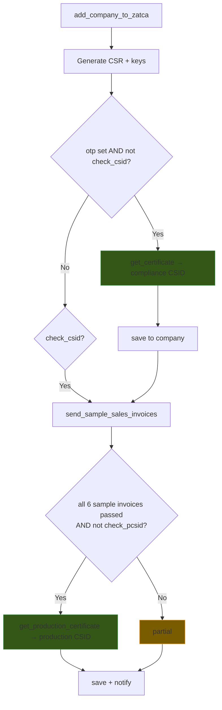
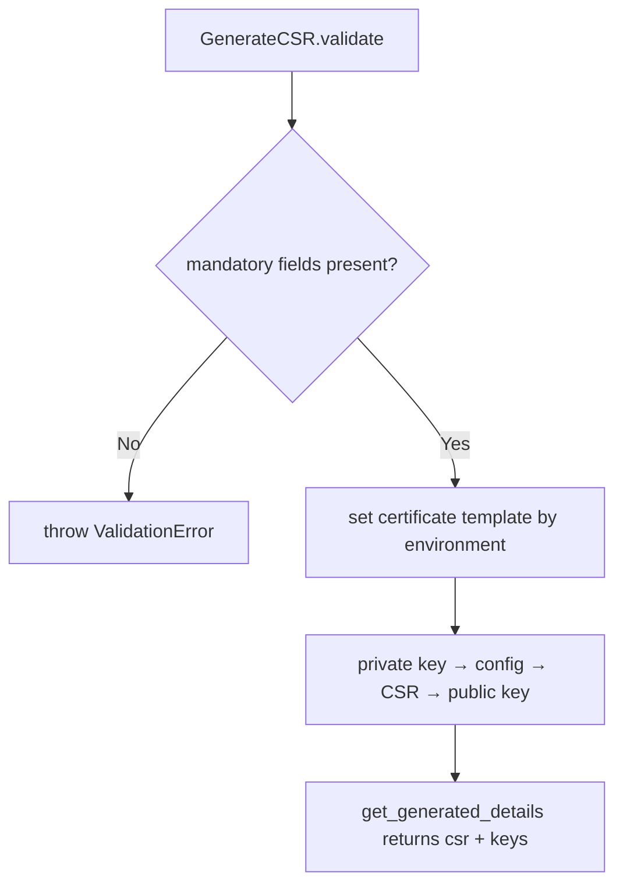

# Onboarding

Developer + power-user reference for **device onboarding** — turning a Commercial Register
into a ZATCA-connected device (CSR → compliance CSID → sample invoices → production CSID).
For the implementer walkthrough, see [user-guide.md](user-guide.md).

Onboarding is orchestrated by one whitelisted entry point and driven from the React wizard at
`/zatca-onboarding`; progress is streamed back over a realtime channel.

Orchestrator: `optima_zatca/zatca/setup.py` → `add_company_to_zatca(name)`
CSR/keys: `optima_zatca/zatca/keys.py` → `GenerateCSR`
HTTP transport: `optima_zatca/zatca/api.py`

---

## The pipeline

`add_company_to_zatca(name)` loads the **Optima Zatca Setting** identified by `name` and runs
the stages below in order. The whole body is wrapped in a `try/except` that routes any failure
to `handle_zatca_error` (realtime 0% + an Error Log row), so a failed stage never leaves a
half-written success.

Stage by stage:

| # | Stage | Function | Effect |
|---|-------|----------|--------|
| 1 | **CSR + keys** | `GenerateCSR(...).get_generated_details()` | Creates private/public key + CSR from company data (see below) |
| 2 | **Compliance CSID** | `get_certificate` → `api.get_zatca_csid` | Submits CSR + OTP to the *compliance* endpoint; stores binary security token, secret, request_id, certificate; sets `check_csid` |
| 3 | **Sample invoices** | `demo.send_sample_sales_invoices` | Submits the compliance sample invoices; sets `invoice_one … invoice_six` as each passes |
| 4 | **Production CSID** | `get_production_certificate` → `api.get_production_csid` | Runs only when **all six** sample flags are set and `check_pcsid` is unset; stores production token/secret/request_id; sets `check_pcsid` |
| 5 | **Save + notify** | `saving_data_to_company`, `notify_completion_status` | Persists to the setting/company and publishes the final realtime status |

The stage gates are the `check_*` flags on the setting — which is exactly what makes
onboarding **resumable**: a re-run skips whatever is already flagged.

---

## CSR generation

`GenerateCSR` (`zatca/keys.py`) shells out to **OpenSSL** to produce the key pair and the
certificate signing request. It validates its inputs first, then generates.

**Crypto (ZATCA-mandated):** the private key is **ECDSA on the `secp256k1` curve**
(`openssl ecparam -name secp256k1 -genkey`), the public key is the **compressed** point
(`ec -pubout -conv_form compressed`, used later in the QR), and the CSR is signed **SHA-256**
(`req -new -sha256`). The `default_bits = 2048` line in the generated `config.cnf` is a
vestigial RSA field — it does **not** apply to the EC key.

The CSR subject and subject-alternative-name fields are filled from company data
(`generate_required_fields`) and the environment:

| CSR field | Maps to | Source |
|-----------|---------|--------|
| `O` (Organization) | `organization_name` | Company `company_name_in_arabic` |
| `OU` (Org. Unit) | `organization_unit_name` | Commercial Register name |
| `CN` (Common Name) | `common_name` | Random 15-char hash |
| `C` (Country) | — | Fixed `SA` |
| SAN `UID` | `organization_identifier` | Company `tax_id` (15-digit VAT) |
| SAN `SN` | `egs_serial_number` | EGS serial, ZATCA `1-…\|2-…\|3-…` format |
| SAN `title` | `invoice_type` | The device's invoice type |
| SAN `registeredAddress` | `address` | Company address |
| SAN `businessCategory` | `industry` | Company industry |
| `certificateTemplateName` | per environment | `sandbox` / `simulation` / `production` each map to their own ZATCA template, with a safe default |

---

## Certificate types

Onboarding yields two certificates, in order — the compliance one gates the production one:

| | Compliance (CSID) | Production (PCSID) |
|---|---|---|
| **Purpose** | Testing & validation (sample invoices) | Live invoice clearance / reporting |
| **Obtained at** | Stage 2, after CSR + OTP | Stage 4, after all sample invoices pass |
| **Setting flag** | `check_csid` | `check_pcsid` |
| **Validity** | ~1 year | ~1 year |

---

## HTTP transport (`zatca/api.py`)

Onboarding touches two of the ZATCA endpoints; the third (`make_invoice_request`) belongs to
the [submission](../submission/) domain.

| Function | ZATCA endpoint | Returns |
|----------|----------------|---------|
| `get_zatca_csid(setting, otp, csr)` | `compliance` | `(request_id, binary_security_token, secret)` — the **compliance** CSID |
| `get_production_csid(setting, token, secret, request_id)` | `onboarding` | The **production** CSID payload (`binarySecurityToken`, `requestID`, `secret`, `tokenType`) |
| `renew_production_csid(setting, otp, authorization, csr)` | `onboarding` | A fresh production CSID (renewal path) |

Both certificate responses are base64 payloads: `_decode_certificate` decodes the binary
security token to the PEM certificate, and `_create_auth_header` builds the
`token:secret` Basic auth header used on later calls.

---

## Realtime progress

Every stage publishes to the **`zatca`** realtime event (`frappe.publish_realtime`), which the
onboarding SPA subscribes to over socket.io. Terminal states:

| Outcome | `percentage` | `indicator` | Message |
|---------|-------------|-------------|---------|
| Full success (`check_pcsid` set) | `100` | green | ZATCA Setup Completed |
| Partial (compliance only) | `50` | red | ZATCA Setup Partially Completed |
| Error (any raised exception) | `0` | red | ZATCA Setup Failed: … |

Intermediate ticks: CSID created → 20%, production CSID created → 95%.

---

## The two config doctypes

### Optima Zatca Setting

One record **per Commercial Register / device** — the entire onboarding state machine lives
here. Field groups:

| Group | Fields |
|-------|--------|
| **Identity** | `company`, `commercial_register`, `address`, `registration_type` |
| **CSR inputs** | `common_name`, `organization_identifier`, `organization_name`, `organization_unit_name`, `egs_serial_number`, `location`, `industry`, `country_name`, `invoice_type` |
| **Environment** | `api_endpoints` (`sandbox` / `simulation` / `production`), `phases` (`Phase 1` / `Phase 2`) |
| **Crypto material** | `private_key`, `public_key`, `csr`, `certificate`, `binary_security_token`, `secret`, `request_id`, `production_request_id`, `authorization`, `token_type` |
| **Stage flags** | `check_csr`, `check_csid`, `check_pcsid`, `invoice_one … invoice_six`, `status` (`Not Connected` / `Connected`) |
| **OTP** | `otp` (entered per run; short-lived) |

### Commercial Register

One record **per device/branch** of a company.

Controller: `optima_zatca/optima_zatca/doctype/commercial_register/commercial_register.py`

| Field | Meaning |
|-------|---------|
| `commercial_register` / `commercial_register_name` | The CR number / display name |
| `company`, `branch`, `address` | Ownership and location |
| `is_main_commercial_register_for_the_company` | Marks the company's primary device |
| `is_default` | Default device for new invoices |
| `disabled` | Excludes the device from selection |

> **One default per company.** The controller rejects a second `is_default` Commercial
> Register for the same company — reuse the existing default rather than creating another.

---

## Renewal

`renew_production_certificate(setting, otp, authorization, csr)` (`zatca/setup.py`) obtains a
fresh production CSID for an already-onboarded device. It needs a **new OTP**, exactly like the
first onboarding, but skips CSR generation and the sample-invoice stage.
