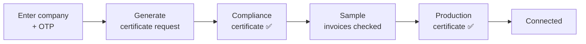

# Onboarding — User Guide

A plain-language guide for implementers to connecting a company's device to ZATCA
(Fatoora). For the technical flow and the fields it writes, see [reference.md](reference.md).

Onboarding is a **one-time** activity per device. You do it once for each **Commercial
Register** (each branch/device that will issue invoices), and after it succeeds that device
can clear and report invoices. You do **not** repeat it for every invoice.

The guided **onboarding wizard** lives at **`/zatca-onboarding`** on your site. It walks you
through the steps below and shows a live progress bar as each stage completes.

---

## Before you start

Onboarding will fail early unless these are ready:

| Prerequisite | Where | Why |
|--------------|-------|-----|
| Company **Arabic name** | Company → `company_name_in_arabic` | Goes into the certificate as the organization name |
| Company **VAT number** (15 digits) | Company → `tax_id` | Goes into the certificate as the organization identifier |
| A **Commercial Register** record | Commercial Register doctype | Identifies the device; onboarding config attaches to it |
| Commercial Registration number | Commercial Register | Goes into the certificate as the organization unit |
| A complete **Saudi National Address** | Company Address | ZATCA validates the address components (below) |
| An **OTP** from the Fatoora portal | ZATCA Fatoora portal | Authorizes this device to request its certificate — valid for a short time, so generate it just before you run onboarding |

The **National Address** must carry all of Saudi Arabia's standard components, or the CSR is
rejected: **Building Number** (4 digits), **Street Name**, **District**, **City**, **Postal
Code** (5 digits), and an optional **Additional Number**.

> **One OTP, one device.** The OTP you generate in the Fatoora portal is tied to the device
> you're registering. If onboarding fails after the OTP expires, generate a fresh one and run
> it again.

> **One device per branch.** Each branch that issues invoices is its own **Commercial
> Register** with its own certificate — onboard them one at a time. Mark the head office as the
> company's main/default register.

---

## Choosing the environment

Onboarding runs against one of three ZATCA environments — pick it on the setting before you
start:

| Environment | Use it for |
|-------------|-----------|
| **sandbox** | First trials and development — throwaway certificates |
| **simulation** | Pre-production rehearsal that mirrors production behavior |
| **production** | The live connection that issues real, legally-valid invoices |

Start in **sandbox** or **simulation** to prove the setup, then run **production** for the
real device. Each environment issues its own certificate — a sandbox certificate can't clear
production invoices.

---

## The steps

1. **Enter the company and OTP.** Select the Commercial Register / company, choose the
   environment, and paste the freshly-generated OTP.
2. **Generate.** The wizard creates the device's cryptographic request and sends it to ZATCA.
   ZATCA returns a **compliance certificate** — the device is now recognized.
3. **Sample invoices.** The wizard automatically submits a set of **sample invoices** so ZATCA
   can verify your invoices are well-formed. All of them must pass.
4. **Production certificate.** Once every sample invoice passes, the wizard requests the
   **production certificate** — the credential that clears and reports real invoices.
5. **Connected.** The status becomes **Connected** and the progress bar reaches 100%.

---

## Reading the result

The progress bar and its color tell you where you landed:

| Result | Meaning | What to do |
|--------|---------|-----------|
| **100% · green** — "Setup Completed" | Production certificate obtained; the device is fully live | Nothing — start invoicing |
| **50% · red** — "Setup Partially Completed" | Compliance certificate obtained, but the production step didn't finish (e.g. a sample invoice didn't pass) | Re-run onboarding; it resumes from where it stopped |
| **0% · red** — "Setup Failed" | An earlier stage errored (bad OTP, missing company field, network) | Fix the cause (often a fresh OTP or a missing Arabic name / VAT number) and run again |

Onboarding is **safe to re-run.** It remembers the stages already done — a partial run
continues from the compliance certificate rather than starting over.

---

## Renewing a certificate

Production certificates expire. When one is near expiry, use **renew** (a fresh OTP is
required, exactly as for the first onboarding) to obtain a new production certificate without
redoing the whole setup.
