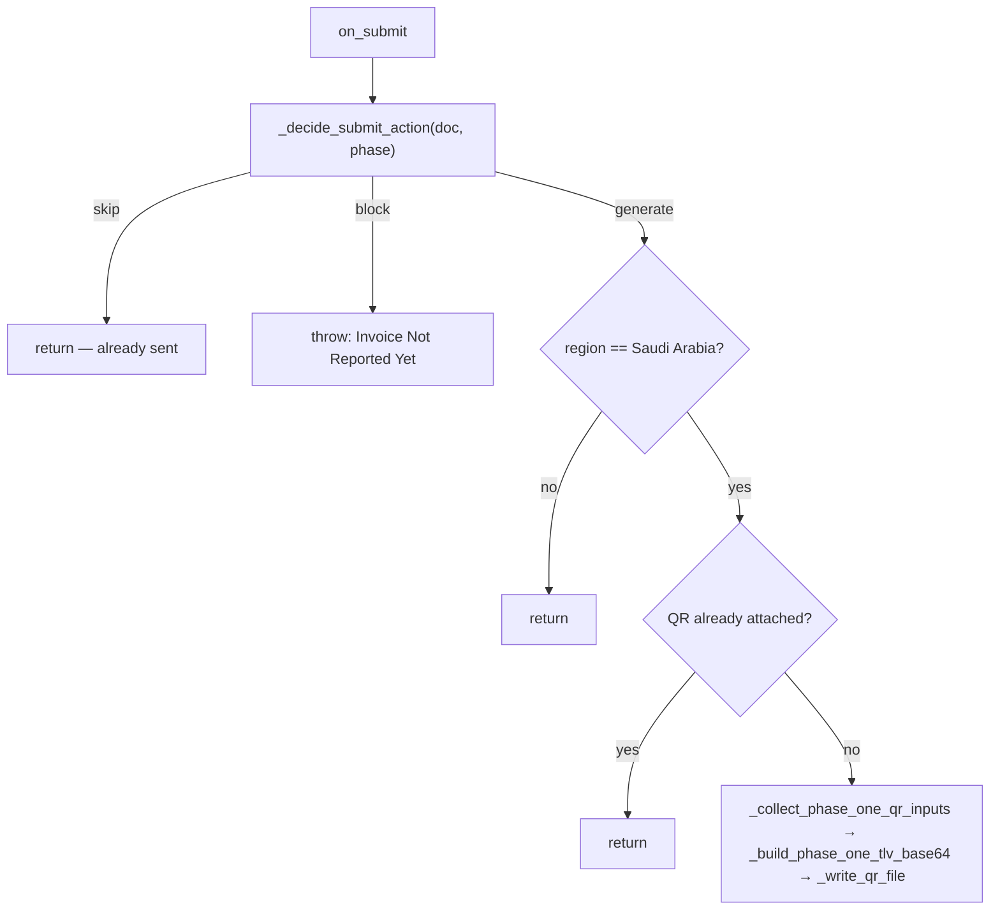

# Phase-1 QR

Developer reference for the **Phase-1 (simplified invoice) TLV QR** and the Sales Invoice
lifecycle guards that surround it. This is an internal subsystem — there is no user guide; the
QR simply appears on the invoice at submit.

Module: `optima_zatca/events/sales_invoice.py`
Wired in `hooks.py` as `doc_events` on **Sales Invoice**: `on_submit`, `before_cancel`,
`on_trash`.

The module follows the same **pure / side-effect split** as the
[submission](../submission/reference.md) pipeline: `_decide_*` functions are pure and
unit-tested directly; DB reads and the File write are isolated.

---

## `on_submit` — when a QR is generated



`_decide_submit_action(doc, phase)` is pure:

| Condition | Action |
|-----------|--------|
| `phase == "Phase One"` | **generate** — always build the QR |
| Phase Two, `sent_to_zatca == 1` | **skip** — sending already produced the ZATCA QR |
| Phase Two, not cleared/reported | **block** — `throw("Invoice Not Reported Yet")` |
| Phase Two, finalized but flag unset | **generate** (fall through) |

After the action, `on_submit` short-circuits when `get_region(company) != "Saudi Arabia"`, and
again if a QR File is already attached (a re-submit), before generating.

---

## The TLV encoding

The Phase-1 QR is a base64-encoded **TLV** (tag-length-value) buffer of **five fields**, per
ZATCA's simplified-invoice spec:

| Tag | Field | Source |
|-----|-------|--------|
| 1 | Seller name | Company `company_name_in_arabic` |
| 2 | VAT registration number | Company `tax_id` |
| 3 | Timestamp | Posting date + time as UTC ISO-8601 |
| 4 | Invoice total (incl. VAT) | `grand_total` |
| 5 | VAT total | Σ of VAT-account tax rows |

`_build_phase_one_tlv_base64(seller_name, tax_id, timestamp, invoice_amount, vat_amount)` is
**pure** and pinned by a golden-bytes test. Each field is one `_tlv_field(tag, value, length)`
triplet: `tag` + `length` byte + UTF-8 value, hex-joined, then the whole buffer is base64'd.

> **The 255-byte cap (pinned current behavior).** `length` is emitted as a single byte
> (`bytes([length])`), so any field over **255 bytes** raises `ValueError`. Tag 1 counts
> **UTF-8** bytes (so a long Arabic seller name can trip it); tags 2–5 count string length.
> This is documented, not fixed — the golden-bytes and over-255 tests lock it in place.

`_collect_phase_one_qr_inputs(doc)` gathers the five values and throws the original
user-facing errors if `company_name_in_arabic` or `tax_id` is unset. `_write_qr_file(doc, ...)`
renders the PNG (`pyqrcode`), attaches it as a **File** on `ksa_einv_qr`, and `db_set`s the URL.

For the **Phase-2** QR (the five fields plus invoice hash, ECDSA signature, public key, and
certificate signature), see [Concepts](../concepts.md) — it is produced during
[submission](../submission/reference.md), not here.

---

## Cancel / delete guards

The same module blocks cancelling or deleting an invoice that ZATCA has finalized, unless the
matching override is enabled in **Zatca Main Settings**:

```
_is_sent_and_finalized(doc) = sent_to_zatca AND clearance_or_reporting ∈ {CLEARED, REPORTED}
```

| Hook | Pure guard | Blocks when | Override |
|------|-----------|-------------|----------|
| `before_cancel` | `_decide_cancel_blocked` | finalized **and** override off | `enable_cancel_invoice` |
| `on_trash` | `_decide_delete_blocked` | finalized **and** override off | `enable_delete_invoice` |

Both guards are pure functions taking the doc + the setting value, so they're unit-tested in the
matrix suite (`events/tests/test_sales_invoice.py`) without a DB. See the app
[CLAUDE.md](../../CLAUDE.md) "Testing rules" for the two-layer suite that covers this module.
