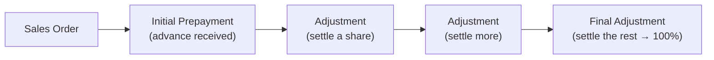

# Prepayment & Adjustment — User Guide

A plain-language guide for accountants to advance-payment invoicing under ZATCA. For the
validation rules, the precision model, and the GL handling, see [reference.md](reference.md).

When a customer pays **in advance**, ZATCA expects a **prepayment invoice** at the time of
payment, and then, as you deliver, **adjustment invoices** that draw that advance down. This
feature models that chain on the Sales Invoice through the **Sales Invoice Type** field.

---

## The invoice types

| Type | When you use it |
|------|-----------------|
| **Normal** | An ordinary sales invoice — no advance involved |
| **Initial Prepayment** | The first advance taken **against a Sales Order** (a Sales Order can have only one) |
| **Prepayment** | A further advance in the same chain |
| **Adjustment** | Settles part of the advance as you deliver, referencing the prepayment |
| **Final Adjustment** | Settles **whatever is left** — its share is filled in for you |

---

## How a prepayment chain works

1. Take the advance with an **Initial Prepayment** invoice against the Sales Order.
2. As you deliver, raise **Adjustment** invoices. Each carries an **adjustment percentage** —
   the share of the advance it settles.
3. Close the chain with a **Final Adjustment**. You don't type its percentage: it's
   **auto-filled and locked** to the remaining share so the whole chain adds up to exactly
   **100%**.

> **The percentages must sum to 100%.** Each adjustment's percentage is checked against how much
> of the advance is left; the Final Adjustment takes the remainder. You can't over-draw a
> prepayment — an adjustment above the remaining share is blocked.

---

## What the system checks

When you save an adjustment invoice, it's validated for you:

- **Required fields** — adjustment percentage, total grands, and grand total must be present.
- **Within range** — the percentage must be between 0% and 100%.
- **Within the remaining limit** — it can't settle more of the advance than is left.
- **Deducted totals** — the deducted grand total can't exceed the invoice's grand total.
- **Payment** — for POS and non-POS invoices, the deducted amount plus what's paid can't exceed
  the grand total.

If any check fails the save is blocked with a message explaining which rule was hit.

## Returns against a prepayment

A return (credit note) tied to a prepayment must reference an **existing** Prepayment Invoice
that **isn't already linked** to another Sales Invoice — this keeps each advance settled once.
