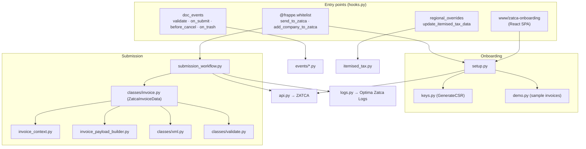

# Architecture

Developer reference for how `optima_zatca` is wired — the layers, the module map, and the design
principle that runs through the submission and lifecycle code. For the app's install/migrate
mechanics see [../setup/](../setup/README.md); for domain detail follow the links below.

---

## Layers



- **[Onboarding](../onboarding/reference.md)** — `setup.py` orchestrates CSR/keys (`keys.py`),
  compliance + production CSID (`api.py`), and sample invoices (`demo.py`).
- **[Submission](../submission/reference.md)** — `submission_workflow.py` orchestrates
  validate → build+sign XML (`classes/`) → POST (`api.py`) → decide → update → log (`logs.py`).
- **[Prepayment](../prepayment/reference.md)** — `events/prepayment.py` (validate) +
  `overrides/sales_invoice.py` (GL) + `prepayment_invoice.py`.
- **[Phase-1 QR](../phase-one-qr/reference.md)** — `events/sales_invoice.py` (on_submit + guards).
- **[Per-item tax](../tax/reference.md)** — `itemised_tax.py` (the Saudi regional override).

---

## Module map

```
optima_zatca/
├── hooks.py                     # override_doctype_class · doc_events · regional_overrides · routes
├── install.py / patches.txt     # after_install + migrations (see ../setup/)
│
├── events/
│   ├── prepayment.py            # Sales Invoice validate → prepayment rules
│   └── sales_invoice.py         # on_submit (Phase-1 QR) · before_cancel · on_trash
├── overrides/
│   └── sales_invoice.py         # CustomSalesInvoice (prepayment GL)
├── setup/
│   ├── customizations.py        # custom fields / property setters
│   └── add_default_print_format.py
│
├── zatca/
│   ├── invoice.py               # send_to_zatca (the ONLY whitelist submit entry)
│   ├── submission_workflow.py   # submission orchestrator + pure _decide_* functions
│   ├── setup.py                 # onboarding orchestrator (add_company_to_zatca)
│   ├── keys.py                  # GenerateCSR (OpenSSL CSR/keys)
│   ├── api.py                   # HTTP transport to ZATCA
│   ├── demo.py                  # compliance sample invoices
│   ├── logs.py                  # make_action_log → Optima Zatca Logs
│   ├── prepayment_invoice.py    # Prepayment Invoice records
│   ├── itemised_tax.py          # regional per-item tax override
│   ├── xml_transport.py         # XML serialize / base64 / QR extraction
│   ├── pdfa3.py                 # embed invoice XML into PDF/A-3
│   ├── request.py · utils.py · sales_order.py
│   └── classes/
│       ├── invoice.py           # ZatcaInvoiceData (facade)
│       ├── invoice_context.py   # InvoiceContextLoader
│       ├── invoice_payload_builder.py
│       ├── xml.py               # ZatcaXml (lxml → hash → sign → QR)
│       └── validate.py          # ZatcaInvoiceValidate
│
├── zatca-onboarding/            # React + Vite onboarding SPA
└── www/zatca-onboarding.html    # SPA entry (served via website_route_rules)
```

---

## Design principle — pure decisions, isolated side effects

The submission path (`submission_workflow.py`) and the lifecycle hooks
(`events/sales_invoice.py`) deliberately separate **pure `_decide_*` functions** (no DB, no HTTP
— unit-tested directly) from **side-effecting functions** (`_submit_*`, `_update_*`, `_log_*`,
`_execute_*`, `_write_qr_file`). New branching logic belongs in a `_decide_*` function.

Two hard constraints when editing these paths:

1. **`send_to_zatca(sales_invoice_name)`** (`zatca/invoice.py`) is the only whitelisted submit
   entry point — its name and signature must not change. Keep helpers private (`_` prefix).
2. **`sales_invoice_on_submit/before_cancel/on_trash(doc, event)`** are wired in `hooks.py` —
   names and signatures must not change.

See the app [CLAUDE.md](../../CLAUDE.md) for the test suites that lock this in.
