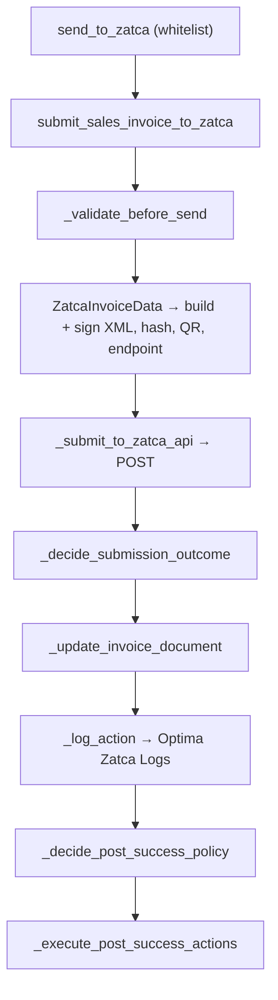

# Submission

Developer + power-user reference for the **Sales-Invoice-to-ZATCA** pipeline — clearance (B2B)
and reporting (B2C). For the accountant-facing flow, see [user-guide.md](user-guide.md).

The pipeline is deliberately layered so the **decision logic is pure and testable**, separate
from the Frappe/HTTP side effects.

Public entry point: `optima_zatca/zatca/invoice.py` → `send_to_zatca(sales_invoice_name)`
Orchestrator: `optima_zatca/zatca/submission_workflow.py` → `submit_sales_invoice_to_zatca(sales_invoice)`

> **Do not change `send_to_zatca(sales_invoice_name)`.** It is the only `@frappe.whitelist`
> entry point; the desk button and other apps call it. Keep new helpers private (`_` prefix).

---

## The pipeline

| Step | Function | Kind | Does |
|------|----------|------|------|
| 1 | `_validate_before_send` | side-effect | Runs `validate` + `before_submit`, checks submit permission; stops on failure |
| 2 | `ZatcaInvoiceData(...)` | side-effect | Builds the UBL XML, signs it, computes hash/QR/UUID, selects the endpoint |
| 3 | `_submit_to_zatca_api` | side-effect | POSTs via `api.make_invoice_request(...)` |
| 4 | `_decide_submission_outcome` | **pure** | Turns the HTTP response into a `SubmissionOutcome` |
| 5 | `_update_invoice_document` | side-effect | Writes `sent_to_zatca`, `clearance_or_reporting`, QR back to the invoice |
| 6 | `_log_action` | side-effect | `make_action_log` → one **Optima Zatca Logs** row |
| 7 | `_decide_post_success_policy` | **pure** | Decides auto-submit + prepayment follow-up |
| 8 | `_execute_post_success_actions` | side-effect | Auto-submits / creates the prepayment invoice |

**Preserve the split.** Branching logic belongs in a `_decide_*` **pure** function (unit-tested
directly); side effects belong in the `_submit_*` / `_update_*` / `_log_*` / `_execute_*`
functions. This mirrors the [Testing rules](../../CLAUDE.md) and the
[phase-one-qr](../phase-one-qr/reference.md) refactor.

---

## The pure decisions

`_decide_submission_outcome` assembles a `SubmissionOutcome` from these pure helpers:

| Helper | Rule |
|--------|------|
| `_is_success_status_code` | Success = HTTP **200** or **202** (202 = accepted-with-warnings) |
| `_decide_invoice_status` | On success, the invoice status = response `clearanceStatus` **or** `reportingStatus`; else `None` |
| `_decide_response_qrcode` | On success, persist the QR from the cleared invoice; else `""` |
| `_decide_log_status` | `Success` (200) · `Warning` (202) · `Failed` (other) |
| `_decide_log_conclusion` | The user-facing summary stored on the log |

`_decide_post_success_policy(is_success, sales_invoice_type, manual_submit_enabled)` governs
whether the invoice **auto-submits** after a clean send (gated by the manual-submit setting) and
whether a prepayment invoice should be created.

---

## Clearance vs reporting

The endpoint is chosen inside `ZatcaInvoiceData` from the invoice type and passed through
`submission_request["endpoint"]` / `["clearance_status"]`:

| Invoice | Endpoint | `clearance_status` |
|---------|----------|--------------------|
| Standard (B2B) | **clearance** | set — ZATCA must clear before validity |
| Simplified (B2C) | **reporting** | not set — reported after issue |

Transport: `optima_zatca/zatca/api.py` → `make_invoice_request(clearance_status, authorization,
invoice_hash, uuid, encoded_invoice, setting, endpoint)`.

---

## The audit trail — Optima Zatca Logs

`_log_action` writes one **Optima Zatca Logs** record per API call via
`optima_zatca/zatca/logs.py` → `make_action_log(**kwargs)`, capturing the request/response XML,
hashes, QR, `log_status`, and conclusion. It is listed in `ignore_links_on_delete`, so deleting
an invoice never trips on its logs.

## Lifecycle guards (post-submission)

The `on_submit` / `before_cancel` / `on_trash` doc_events enforce the ZATCA rules around a sent
invoice — Phase-2 submit-gating and the cancel/delete block on a finalized invoice. Those live
in `optima_zatca/events/sales_invoice.py`; see [phase-one-qr/reference.md](../phase-one-qr/reference.md)
for the submit-time QR path and the guard decision table.
