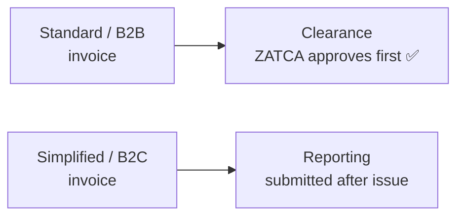

# Submission — User Guide

A plain-language guide for accountants and implementers to sending invoices to ZATCA. For the
pipeline and its decision logic, see [reference.md](reference.md).

Once a device is [onboarded](../onboarding/user-guide.md) and you're on **Phase 2**, each Sales
Invoice is sent to ZATCA to be made valid. You do this from the invoice itself — there's a
**Send to ZATCA** button on a submitted Sales Invoice.

---

## Clearance vs reporting — which one happens

You don't choose this; the **invoice type decides** (see [Concepts](../concepts.md)):

- **Standard (B2B)** invoices go to **clearance** — ZATCA validates and stamps the invoice
  before it's legally valid.
- **Simplified (B2C)** invoices go to **reporting** — they're issued first and reported to
  ZATCA after.

---

## What you'll see after sending

Every send records its result on the invoice and writes a log:

| Result | Meaning | What to do |
|--------|---------|-----------|
| **Success** | ZATCA accepted (cleared or reported) cleanly | Done — the invoice now carries its ZATCA status and QR |
| **Warning** | Accepted, but ZATCA returned warnings | Usually fine to keep; review the warnings in the log |
| **Failed** | ZATCA rejected it | Read the log's conclusion, fix the cause, and send again |

The outcome is stored on the invoice (its clearance/reporting status and the sent flag), and a
full record of every attempt — request, response, hashes, QR — is written to an **Optima Zatca
Logs** entry you can open to see exactly what ZATCA returned.

---

## After a successful send

Depending on your settings, a successfully-sent invoice can **submit automatically**. If the
**manual-submit** option is on, you keep the invoice in draft and submit it yourself after the
send. Adjustment/prepayment invoices also trigger their linked bookkeeping at this point — see
[prepayment](../prepayment/user-guide.md).

## If a send fails

Sending is safe to repeat. Fix whatever the log points at (a missing field, a network error, a
rejected value) and press **Send to ZATCA** again — nothing is finalized until ZATCA accepts.

> **Cancelling / deleting a sent invoice is blocked.** Once an invoice is cleared or reported,
> it can't be cancelled or deleted unless an administrator enables the corresponding override in
> **Zatca Main Settings** — this keeps your records aligned with what ZATCA holds.
