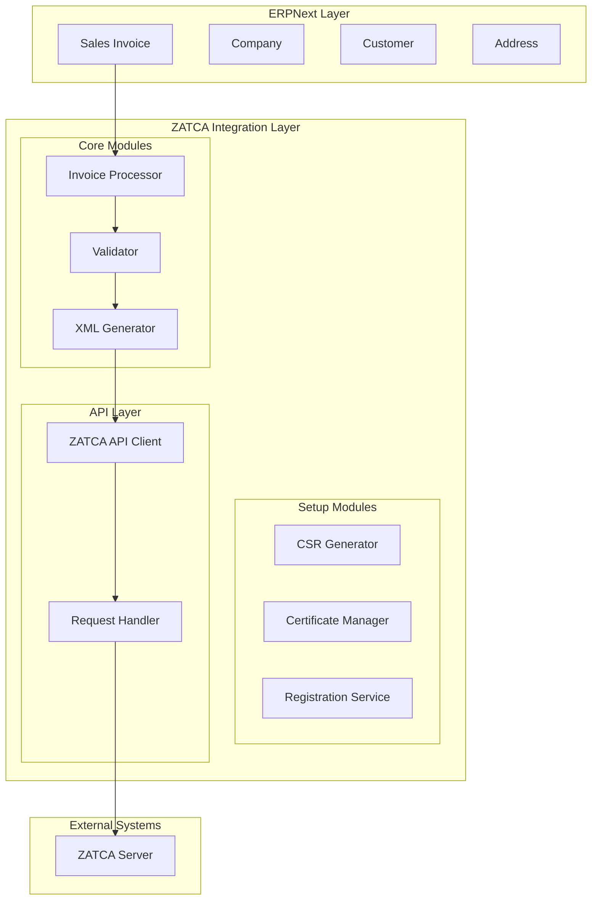

```mermaid
graph TB
    subgraph "ERPNext Layer"
        SI[Sales Invoice]
        CO[Company]
        CU[Customer]
        AD[Address]
    end
    
    subgraph "ZATCA Integration Layer"
        subgraph "Core Modules"
            IV[Invoice Processor]
            XG[XML Generator]
            VA[Validator]
        end
        
        subgraph "Setup Modules"
            CS[CSR Generator]
            CM[Certificate Manager]
            RS[Registration Service]
        end
        
        subgraph "API Layer"
            ZA[ZATCA API Client]
            RQ[Request Handler]
        end
    end
    
    subgraph "External Systems"
        ZS[ZATCA Server]
    end
    
    SI --> IV
    IV --> VA
    VA --> XG
    XG --> ZA
    ZA --> RQ
    RQ --> ZS
```